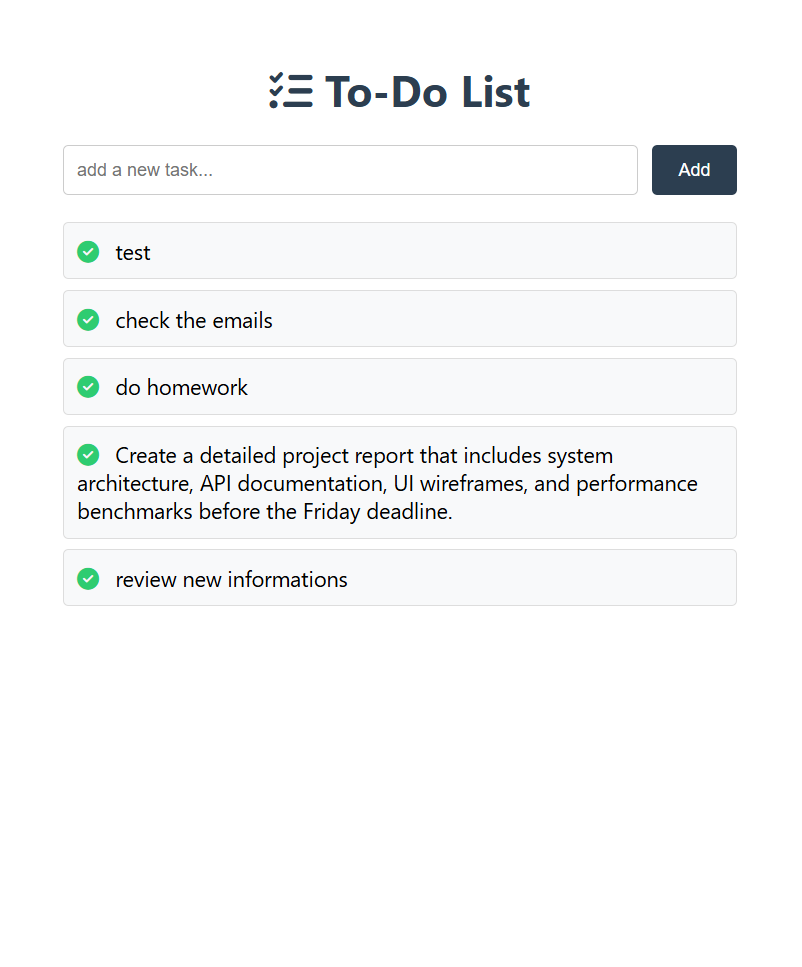

# To-Do List App

A simple to-do list application built with Vue.js (frontend) and Node.js + Express + MongoDB (backend).

---

```bash
cd todo-list-vue

## Install frontend dependencies and run the app:
```
npm install
```

### Compiles and hot-reloads for development
```
npm run serve
```

### Navigate to the backend folder, install dependencies and start the server:
```
cd todo-backend

npm install

node index.js
```

### Compiles and minifies for production
```
npm run build
```

### Lints and fixes files
```
npm run lint
```

## App Screenshot



Frontend runs at: http://localhost:8080

Backend runs at: http://localhost:3000

### Customize configuration
See [Configuration Reference](https://cli.vuejs.org/config/).
